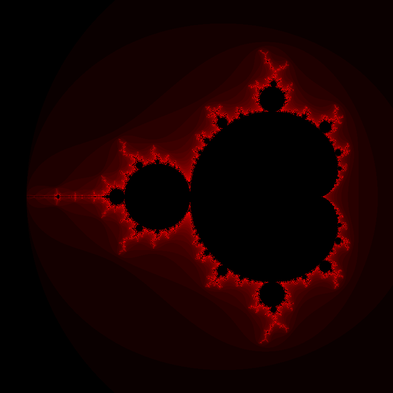

# Computation of the Mandelbrot set

This directory contains the sequential computation of the Mandelbrot set and
represents the starting point for the exam project. The output of the program is
a PNG image of the set.

## Dependencies

The program requires SFML and, for the parallel version, oneAPI Threading
Building Blocks (oneTBB). Both are available as Ubuntu packages. To install
them:

```shell
sudo apt install libsfml-dev libtbb-dev
```

## Build

To build the program in Debug mode:

```shell
cmake -S . -B build_debug -DCMAKE_BUILD_TYPE=Debug
cmake --build build_debug
```

To build the program in Release mode:

```shell
cmake -S . -B build_release -DCMAKE_BUILD_TYPE=Release
cmake --build build_release
```

## Run

To run the program:

```shell
build_debug/mandelbrot
```

Similarly for the Release version.

The program produces a PNG file called `mandelbrot.png` in the current directoy.

